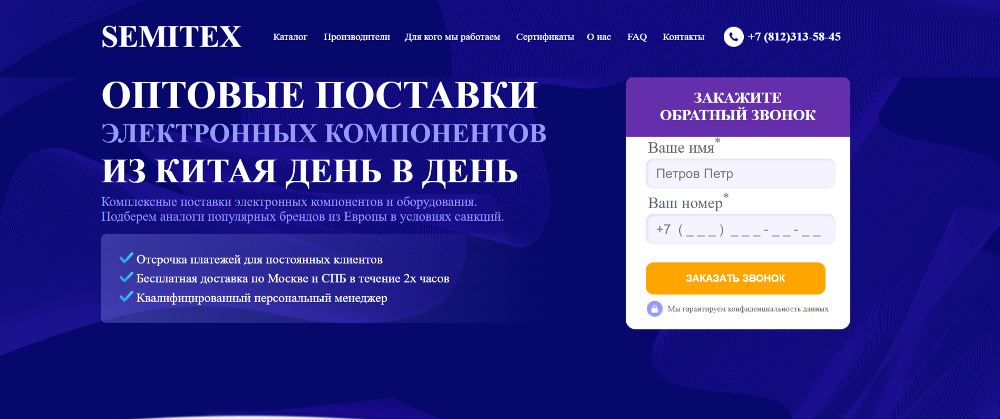

<h1>SEMITEX - оптовый поставщик электронных компонентов</h1>

<h2>Цель проекта:</h2>

Адаптивная верстка по макету с минимальными элементами "логики"

<h2>Инструменты:</h2>
	<ul>
		<li>HTML</li>
		<li>CSS</li>
		<li>JS</li>
		<li>Figma</li>
		<li>GIT</li>
	</ul>

<h2>Результат:</h2>

<h2>Описание:</h2>
