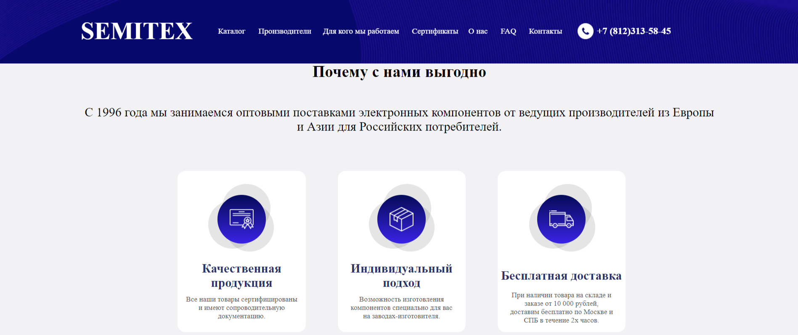
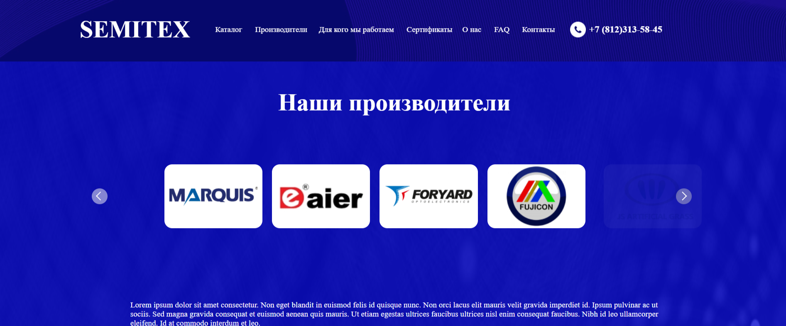
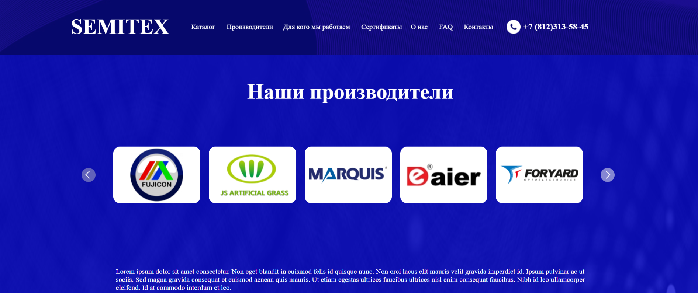
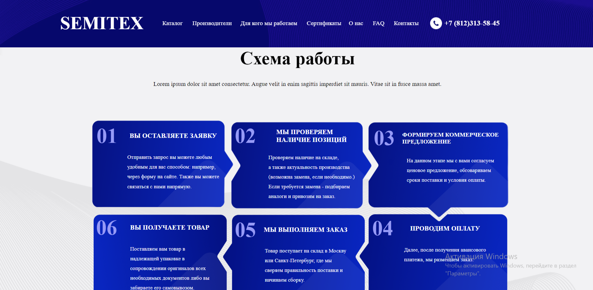
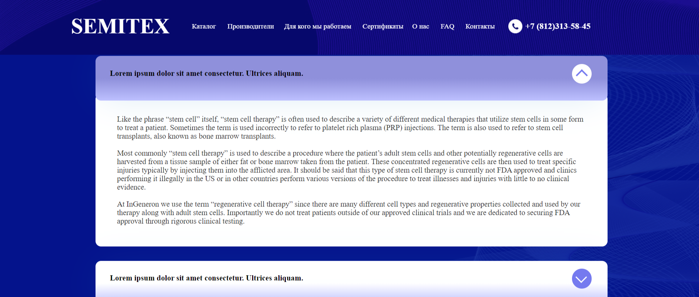

<h1>SEMITEX - оптовый поставщик электронных компонентов</h1>

<h2>Цель проекта:</h2>

Адаптивная верстка по макету с минимальными элементами "логики"

"Языки"(инструменты) были взяты самые базовые. Фреймворки, препроцессоры и т.д. ожидают своего участия в дальнейших проектах

<h2>Инструменты:</h2>
	<ul>
		<li>HTML</li>
		<li>CSS</li>
		<li>JS</li>
		<li>JQuery</li>
		<li>Figma</li>
		<li>GIT</li>
	</ul>

<h2>Результат:</h2>

<h2>Описание:</h2>

Итак, начнем с начала. Шапка закреплена при скроле и содержит в себе панель навигации. Кнопки навигации глухие, при наведении 
меняется лишь состояние курсора.

Далее идет блок общей информации с формой, форма так-же глухая.

Затем идет второй блок "почему с нами выгодно". При наведении на карточки фоновый цвет меняется на серый.

Ниже находится третий блок "Наши производители", данный блок оснащен плавной каруселью, написанной на JQuery

Предпоследний блок - "Схема работы" не имеет какой-либо динамике, карточки в нем имеют абсолютное позиционирование

Финальный блок для основного содержимого - "Ответы на самые популярные вопросы в сфере", в последнюю часть был внедрен
список с выпадающим при нажатии на кнопку описанием, при наведении на элемент списка меняется фоновый цвет самого элемента. 
Список так же можно закррыть при нажатии на ту же кнопку, анимация отсутствует, потому при работе функционал кажется резким.

Подвал не имеет каких либо интересных деталей, кроме того что напоминает шапку (как бы закольцовывая проект и возвращая к
началу страницы, с дизайнерской стороны).

Проект адаптивен под любые экраны, пропорции сохраняются посредством относительных единиц измерения vw.

Надеюсь данный проект принесет пользу и приведет заблудшего путника в райскую долину...

Не знаю зачем, но оставлю <a href="https://t.me/shch_88" target="_blank">ссылку на телегу 
